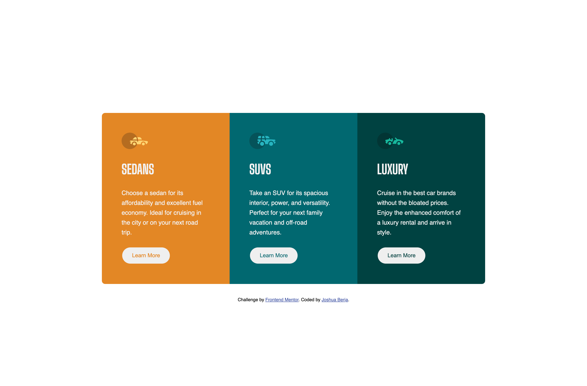

# Frontend Mentor - 3-column preview card component solution

This is a solution to the [3-column preview card component challenge on Frontend Mentor](https://www.frontendmentor.io/challenges/3column-preview-card-component-pH92eAR2-). Frontend Mentor challenges help you improve your coding skills by building realistic projects. 

## Table of contents

- [Overview](#overview)
  - [The challenge](#the-challenge)
  - [Screenshots](#screenshots)
  - [Demo](#demo)
  - [Links](#links)
- [My process](#my-process)
  - [Built with](#built-with)
  - [What I learned](#what-i-learned)
  - [Continued development](#continued-development)
  - [Useful resources](#useful-resources)
- [Author](#author)

## Overview

### The challenge

Users should be able to:

- View the optimal layout depending on their device's screen size
- See hover states for interactive elements

### Screenshots

#### Desktop preview


#### Mobile preview


### Demo

- Demo: [YouTube video](https://youtu.be/QFOKWJU1yJc)

### Links

- Live Site URL: [GitHub Pages](https://joshberja.github.io/3-column-preview-card-component)

## My process

### Built with

- CSS variables
- Flexbox
- Media Query
- Mobile-first workflow

### What I learned

Along the way I learned about using CSS variables to make the stylesheet a bit more easier to read:

```css variables
:root {
    --very-light-gray: hsl(0, 0%, 95%);
    --bright-orange: hsl(31, 77%, 52%);
    --dark-cyan: hsl(184, 100%, 22%);
    --very-dark-cyan: hsl(179, 100%, 13%);
}
```

### Continued development

I need more practice with creating responsiveness.

### Useful resources

- [A Complete Guide to Flexbox](https://css-tricks.com/snippets/css/a-guide-to-flexbox/) - This guide helped me for styling the desktop screen size media query.

## Author

- GitHub - [Joshua Berja](https://github.com/joshberja)
- Frontend Mentor - [@joshberja](https://www.frontendmentor.io/profile/joshberja)